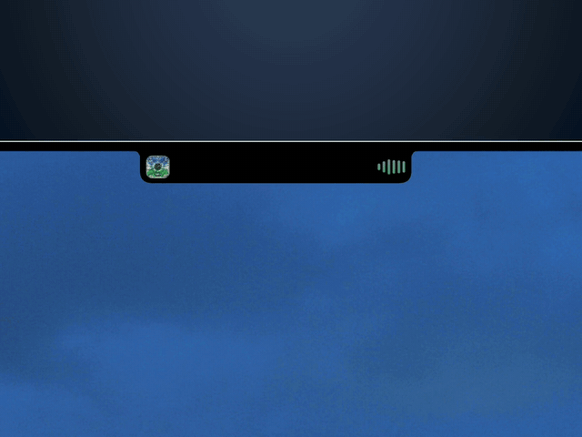

# Isle

**A Dynamic Island for the MacBook notch — for Spotify and Claude Code.**



Isle turns the dead space around the camera housing into a live, interactive
island. It shows what's playing and reacts to the music with a real audio
waveform, and it reports what your Claude Code session is doing, opening on its
own when Claude needs you. It expands on hover and folds away when you're done.

> **Windows:** a port with the same island, Music / Claude Code / Pomodoro
> faces and hook bridge lives in [`windows/`](windows/README.md). It is an
> Electron app driven by Windows' media session API — no Xcode involved.

---

## Install

Isle uses a private framework and AppleScript automation, which rules out the
Mac App Store. It ships as a disk image you install yourself, and updates itself
from there.

### 1. Download and drag to Applications

[**Download Isle 0.3.1**](https://github.com/matthewhamilton3141/isle/releases/latest)
— universal (Apple Silicon and Intel), macOS 14 or newer. Open the disk image and drag **Isle** into
**Applications**.

### 2. Clear the quarantine flag

Isle is code-signed, but not with a paid Apple Developer ID. macOS therefore
quarantines the download and refuses to open it, usually reporting *"Isle is
damaged and can't be opened."* That message describes the missing notarisation,
not the file. One command clears it:

```bash
xattr -dr com.apple.quarantine /Applications/Isle.app
```

Isle then opens normally. This is a one-time step — in-app updates are not
quarantined, so it does not recur on later versions.

<details>
<summary>If the disk image itself won't mount</summary>

The same flag, applied to the download:

```bash
xattr -dr com.apple.quarantine ~/Downloads/Isle-0.1.3.dmg
```
</details>

<details>
<summary>What the command does</summary>

`com.apple.quarantine` is an extended attribute macOS attaches to downloaded
files. Gatekeeper reads it, finds no Developer ID signature and no notarisation
ticket, and blocks the app. `xattr -dr` removes that attribute from the bundle,
which tells macOS you vouch for the app yourself. Nothing about the app changes:
the code is untouched and still signed, just not by an identity Apple has on
file.

Run it only on software you trust, from a source you trust. Isle's full source
is in this repository, and a build you compile yourself never carries the flag.
</details>

### 3. Choose a mode

First launch asks what Isle should be: **Music**, **Claude Code**, or **Both**.
The choice is changeable at any time in Settings. Only the subsystems the active
mode needs are started, so a Claude-only install never requests Spotify
permissions.

### 4. Choose what Isle may ask for

The next screen lists the features that need a macOS permission, all ticked.
Nothing starts until you press Continue, so Isle only ever asks for what you
left ticked:

- **Live waveform** (Music and Both) — the bars move with the music. macOS
  asks for *Audio Recording* the first time something plays. Unticked, the
  waveform still animates; it just doesn't listen.
- **Device batteries** — a Bluetooth device's battery level shows when it
  connects. macOS asks for *Bluetooth* as soon as you continue. Unticked, Isle
  never looks.
- **Events & reminders** — the expanded notch gains an Agenda face listing
  what's left of today, and the island shows each event shortly before it
  starts and each reminder as it comes due. macOS asks for *Calendars* and
  *Reminders* as soon as you continue. Unticked, Isle never looks. Settings
  can switch the two on and off separately.

In Music and Both modes, macOS also asks for **Automation → Spotify** on first
use, for the transport controls. That one is required for playback control.

All of these can be changed later in **System Settings → Privacy & Security**,
and the waveform, device, calendar and reminder toggles live in Isle's
Settings too. Isle is signed
without an Apple Developer ID, so macOS ties its answers to the exact build and
asks again after an update.

Isle runs as a menu bar app with no Dock icon.

### Requirements

| | |
|---|---|
| Operating system | macOS 14 Sonoma or newer |
| Processor | Apple Silicon or Intel (universal build) |
| Waveform | macOS 14.4 or newer (Core Audio process-tap API) |
| Music source | Spotify |
| Claude source | Claude Code |
| Building from source | Xcode 16 or newer |

---

## Features

- **Now playing at a glance.** Album art, title, and artist in the collapsed
  notch; hover to expand into full controls and a scrubbable playbar.
- **An audio-reactive waveform.** A Core Audio process tap on Spotify drives the
  equalizer from the actual signal, so it moves with the music and not with
  anything else on the system.
- **Transport controls.** Play, pause, next, previous, scrub, shuffle, and
  repeat, sent directly to Spotify.
- **Sharp artwork.** Cover art is decoded at true pixel resolution, so the small
  collapsed thumbnail stays crisp.
- **Live Claude Code status.** Working, waiting on you, done, or failed, with a
  breathing glyph while a turn runs and a checkmark when it lands.
- **Both sources at once.** In Both mode the collapsed island splits between
  music and Claude, and the expanded view cycles between its faces.
- **Your day, at a glance.** With Calendar or Reminders on, the expanded
  notch has an Agenda face: today's date, then what's left of the day — events
  still to come or in progress, and reminders due — each in its calendar's
  colour. Three lines show at a time; swipe to scroll the rest, or click the
  date to open Calendar. A calendar event also borrows the collapsed island a few minutes
  before it starts, and a reminder as it comes due, then hands it straight
  back. All-day events and date-only reminders are listed but never announced,
  and declined invitations are left out.
- **Stays out of the way.** A borderless, non-activating overlay that never
  takes focus and never resizes the window under the cursor.

### The menu bar

| Item | Description |
|---|---|
| Toggle Notch | Show or hide the island |
| Pop out notch for alerts | Whether Claude alerts expand the island on their own |
| Settings… | Mode, music options, Claude hook, power and calendar updates, app updates |
| Setup… | Re-run the first-launch mode and permissions picker |
| Check for Updates… | Check for a new version immediately |
| Marker Editor… | Design the dot-matrix markers for each Claude state |
| Animation Gallery… | Preview the island's animations |
| Quit Isle | |

### Updates

Isle checks for updates on launch and on demand. Each release is published as a
disk image alongside a `latest.json` manifest signed with an Ed25519 key whose
public half is compiled into the app, so an unsigned or mismatched update is
rejected before installation.

---

## Claude Code

Isle reports the live status of a [Claude Code](https://claude.com/claude-code)
session in the notch, expanding on its own when Claude is waiting on you.

To set it up, open **Settings → Claude Code → Install**. This places a helper
script in `~/.isle/bin` and merges Isle's hook entries into
`~/.claude/settings.json`, leaving any existing hooks untouched. **Remove**
reverses both. Installations from earlier versions are updated automatically at
launch.

Claude's hooks invoke the helper, which writes one small JSON file per session
to `~/.isle/sessions/<session-id>.json`. Isle watches that directory for
file-system events and maps each session's state to a marker: `working`
breathes, `needs_approval` opens the island even when the pointer is elsewhere,
and `done` shows a checkmark before settling back. When several sessions are
live, one needing attention takes precedence over one merely working, regardless
of the order they were written.

Liveness does not depend on the hooks firing. Isle also reads the CLI's own
`~/.claude/sessions/<pid>.json` records, so a session that is killed outright
cannot leave the island stuck on *Thinking*. When a turn has gone unanswered for
45 seconds with no tool running, the island reports that observation rather than
inferring a cause.

[ROADMAP.md](ROADMAP.md) tracks what is built and what is planned.

---

## Troubleshooting

**"Isle is damaged and can't be opened."** This is the quarantine flag, not a
corrupt download. Run the `xattr` command from [Install](#2-clear-the-quarantine-flag).

**Nothing appears in the notch.** Isle has no Dock icon. Use **Toggle Notch**
from the menu bar item. Isle also runs on Macs without a notch, drawn against
the top edge of the display.

**The waveform doesn't move.** Check that **Waveform** is set to *Live* in
Settings → Music; *Animated* never listens by design. Live capture requires
macOS 14.4 or newer and permission to record audio — the *Audio Recording
Privacy…* button in that section opens the right pane. Isle can't tell a
declined permission from silence, so it won't say which it is.

**The controls do nothing.** Automation permission for Spotify was declined.
Re-enable Isle under **System Settings → Privacy & Security → Automation**.

**No event or reminder ever shows.** Check the two switches under
**Settings → Calendar & Reminders**. Each says outright if its permission was
declined, with a button to the right Privacy pane, and the Agenda face says so
too. The island only announces a moment: all-day events and reminders with a
date but no time are listed on the Agenda face but never announced, and
invitations you declined are skipped entirely.

**The Claude glyph never changes.** Confirm the hook is installed under
**Settings → Claude Code**, and that `~/.claude/settings.json` still contains the
`isle-cli` entries. Sessions started before the hook was installed do not
report.

---

## Development

### Build from source

```bash
git clone https://github.com/matthewhamilton3141/isle.git
cd isle

# One-time: build the bundled now-playing bridge.
./scripts/build-mediaremote-adapter.sh

open Isle.xcodeproj    # then ⌘R
```

Locally built copies are never quarantined, so the `xattr` step does not apply.

### How the media layer works

Reading now-playing state on modern macOS is harder than the obvious API
suggests, which is why the media layer is split three ways.

The textbook approach is to `dlopen` Apple's private `MediaRemote` framework and
call `MRMediaRemoteGetNowPlayingInfo`. **That no longer works.** Around macOS
15.4 Apple gated the read side behind an entitlement third-party apps cannot
obtain. The call still *succeeds*; it simply returns an empty dictionary, so an
app built the direct way silently never shows a track. This remains the case as
of macOS 26.5.

| Operation | Mechanism | Source |
|---|---|---|
| Read now-playing | `mediaremote-adapter` subprocess | `Media/MediaRemoteAdapterClient.swift` |
| Play, pause, next, previous, seek | AppleScript to Spotify | `Media/SpotifyController.swift` |
| Audio waveform | Core Audio process tap on Spotify | `Media/SystemAudioLevels.swift` |
| Claude status | Per-session JSON and file-system events | `Claude/ClaudeStatusWatcher.swift` |

Reads go through [`mediaremote-adapter`][mra], which loads MediaRemote inside
`/usr/bin/perl` — an Apple-signed binary that does hold the entitlement — and
streams JSON lines back over a pipe. Isle runs it as a long-lived child process.
A 1 Hz AppleScript poll of Spotify runs alongside it and owns the playback
clock, since it reads Spotify's true player position and stays accurate through
seeks and restarts.

Commands address Spotify by name over AppleScript. Isle is Spotify-scoped, so
targeting the app directly is both simpler and more accurate than routing
through whichever app currently owns the system session.

`scripts/build-mediaremote-adapter.sh` fetches a pinned upstream tag, compiles a
universal framework with `clang`, and installs it and the Perl driver into
`Isle/Resources/`. Isle never links the framework; it invokes it by path, so the
framework ships as a plain resource.

### Project layout

```
Isle/
├── IsleApp.swift              # @main, agent app + menu bar item
├── Core/                      # AppSettings, IsleMode (music / claude / both)
├── Notch/                     # the overlay: window, shape, state, views
│   ├── NotchWindow.swift              borderless non-activating NSPanel
│   ├── NotchHostingView.swift         hit-testing clipped to the drawn shape
│   ├── NotchViewModel.swift           media + Claude feeds, playback clock
│   ├── IslandToast.swift              the momentary island message (power, calendar)
│   ├── CollapsedNotchView.swift
│   ├── ExpandedNotchView.swift        music tab
│   └── ClaudeExpandedView.swift       Claude tab
├── Media/
│   ├── MediaPlaybackModel.swift       now-playing snapshot (value type)
│   ├── MediaRemoteAdapterClient.swift reads (subprocess)
│   ├── SpotifyController.swift        poll + commands (AppleScript)
│   └── SystemAudioLevels.swift        audio-reactive waveform
├── Claude/
│   ├── ClaudeStatusWatcher.swift      per-session status files
│   ├── ClaudeSessionRegistry.swift    liveness from the CLI's own records
│   ├── HookInstaller.swift            installs and removes the hooks + helper
│   ├── ClaudeStatusGlyphView.swift    the glyph
│   └── BreathingShapeView.swift       the working animation
├── Power/
│   ├── PowerMonitor.swift             Mac battery, IOKit run-loop source
│   ├── BluetoothBatteryMonitor.swift  peripheral levels (system_profiler)
│   └── PowerToast.swift               the power and battery messages
├── Agenda/
│   ├── AgendaMonitor.swift            calendar events and reminders (EventKit)
│   ├── AgendaExpandedView.swift       the Agenda face of the expanded panel
│   └── AgendaToast.swift              the event and reminder messages
├── Markers/                   # designable dot-matrix markers per Claude state
├── Components/                # MarqueeText, EqualizerView, ArtworkColors
├── Settings/, Onboarding/     # settings pane, first-launch mode picker
├── Update/                    # signed-manifest updater
└── Resources/                 # adapter framework + .pl (build script output)
```

Two decisions shape most of the overlay code:

- **The panel never resizes.** It is created at its fully-expanded size, and only
  the SwiftUI content animates. Resizing an `NSWindow` every frame fights the
  window server and tears along the notch edge. Hit-testing is restricted to the
  drawn shape so the invisible remainder does not absorb clicks.
- **The playback clock is smoothed, not sampled.** The scrubber runs off its own
  anchor and eases toward reported positions, keeping it continuous between the
  coarse updates the source applications provide.

### Cutting a release

```bash
swift scripts/isle-sign.swift keygen   # once — writes the private key to ~/.isle-signing/
scripts/sign-release.sh                # builds, packages, signs, writes dist/latest.json
```

The script verifies its own signature against the public key embedded in
`Isle/Update/Updater.swift` before writing the manifest, so it cannot publish a
disk image the app would reject. Upload both the disk image and `latest.json` to
the GitHub release for the matching tag.

---

## License

Isle is released under the [MIT License](LICENSE), © 2026 Matthew Hamilton.

- **[`mediaremote-adapter`][mra]** — BSD-3-Clause, © 2025 Jonas van den Berg.
  Vendored into `Isle/Resources/` by the build script, with its license text
  copied alongside it.
- **[boring.notch][bn]** — GPL-3.0, credited as prior art for overlay-window and
  now-playing technique. No code from it is used in Isle, and none can be
  without relicensing Isle under the GPL.

[mra]: https://github.com/ungive/mediaremote-adapter
[bn]: https://github.com/TheBoredTeam/boring.notch
